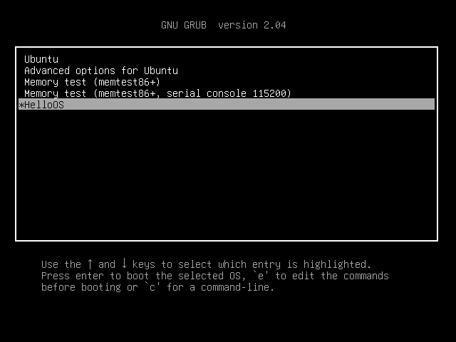

# 构建最简单的内核

利用GRUB引导程序简化编程

# `entry.asm`

注意此时CPU已经运行在**保护模式**

## GRUB多引导协议头

## 初始化执行环境

1. 关中断
- 注意除了`cli`指令外还关闭了不可屏蔽中断

2. 加载GDT
- 加载自己的

3. 初始化栈

4. 调用主函数main
`printf`函数需要自己实现

# `main.c`

## 操作显卡
- 显卡的VESA标准包含字符模式、图形模式
- 字符模式用两个字节表示，ASCII码、字符颜色

# 编译
```
make
```
通过`ld -T`选项指定了一个scriptfile。

# 安装

Hello OS启动项

```
menuentry 'HelloOS'{
    insmod part_msdos
    insmod ext2
    set root='hd0,msdos5' #根据情况更改
    multiboot2 /boot/HelloOS.bin
    boot
}
```
这这段代码复制到`/boot/grub/grub.cfg`

查看boot目录挂在的分区
```
$ df /boot/
Filesystem     1K-blocks     Used Available Use% Mounted on
/dev/sda5       61145932 10704752  47305436  19% /
```

将HelloOS.bin复制到`/boot/`目录下

# 结果
重启前务必给虚拟机拍摄**快照**




